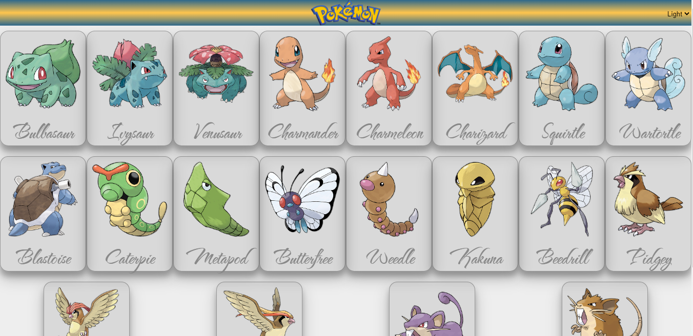
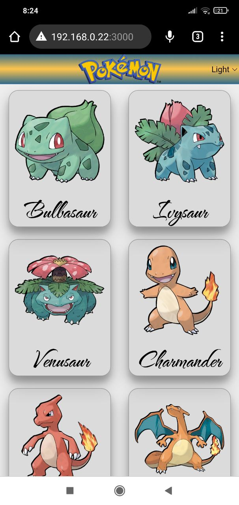

# Pokedex

## Descrição

Uma página inicial (home page) com a listagem de alguns pokemons utilizando a api "https://pokeapi.co/". A home apresenta uma listagem com 10 pokemons iniciais e um botão para carregar mais 10 pokemons a cada vez que for clicado, adicionando-os à lista. A página também possui um alternador de tema que modifica as cores de fundo e texto da página. 
Cada pokemon é clicável e leva a uma página interna com detalhes do respetivo pokemon detalhes como: movimentos, tipo e habilidade.

## Funcionalidades e Ferramentas

A aplicação é uma Single Page Application (SPA) desenvolvida utilizando React.js juntamente com "Context API" para criação de temas, "Router" para alternar as páginas, "Axios" para acesso a api e "Styled Components" para a estilização da página.

## Instalação

Clone o repositório. Você precisará ter instalado o `node` e o `npm`

Instalação das dependências:

`npm install`

Inicialize o servidor:

`npm start`

Acesse o site:

`localhost:3000`

## Roadmap

- [x] Criar aplicação
- [ ] Adicionar ferramenta de pesquisa e filtros
- [ ] Adicionar um editor de temas
- [ ] Adicionar suporta para outra linguas 